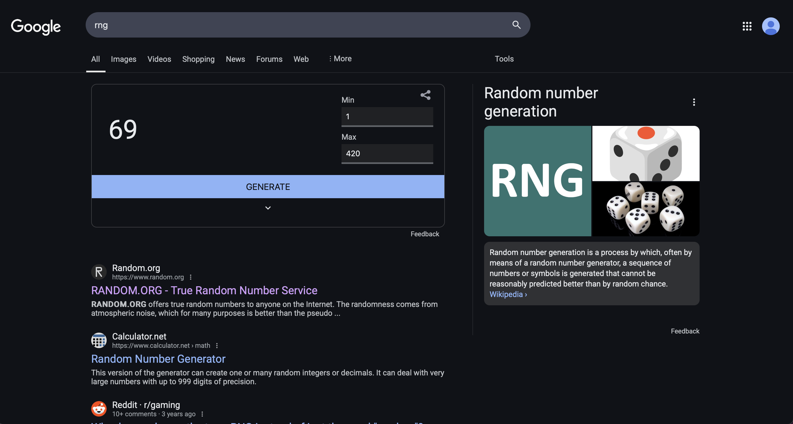

# 🎲 Rigged RNG Generator 🎩✨  
### The *totally fair* random number generator... that isn't random at all.

  
(*Totally legit, nothing to see here... move along.*)  

Ever wanted to **win an argument with undeniable "random" proof**?  
Need to **convince your friends you're the luckiest person alive**?  
Or maybe just **prank someone into thinking the universe is on your side**?  

Well, my friend, **this is the tool for you.**  

## 🛠 What is this?  
This is a **fake** random number generator that *looks* real but always lands on your pre-selected numbers.  
It mimics **Google’s RNG search result page**, complete with a realistic UI, search bar, and even fake search results to make it *just believable enough*.  

### Features:
✅ **Preselect your "random" numbers** – Input specific numbers or ranges (e.g., `1,2-6,9`).  
✅ **Random or Sequential mode** – Either shuffle between your rigged numbers or cycle through them in order.  
✅ **Google-ish search results page** – Not *exactly* like Google, but close enough to fool your grandma.  
✅ **Smooth rolling animation** – Adds that dramatic effect before landing on your totally-not-rigged number.  
✅ **Pure evil fun.** 😈  

## 🚀 How to Use  
1. Open [**this link**](https://kevintr303.github.io/google-fake-rng/) in a browser.  
2. Enter your **"random"** number preferences.  
3. Click **Generate Fake RNG** – this will take you to a Google-style RNG page.  
4. Click the **"Generate"** button on the page to watch your rigged number appear as if by *magic*.  
5. Profit. 💰  

## 📺 Demo  
🎥 Coming soon (or just try it yourself, it's more fun that way).  

## 🎭 Examples of *Totally Fair* Uses  
- **“Let's settle this with a random number.”**  
- **“I bet you I can get 7 three times in a row.”**  
- **“See? The universe wants me to go first.”**  
- **"Let’s let fate decide… 😏"**  
- **“Wow, what are the odds?!?”**  

## ⚠️ Disclaimer  
This tool is for **entertainment purposes only**. Please don’t use it for **actual gambling, lottery manipulation, or stock market predictions**. (We’d like to stay out of legal trouble, thanks.)  
Use responsibly. Or irresponsibly. We’re not your mom.  

## 👾 Tech Stuff  
- **HTML, CSS, JavaScript** – No backend, runs entirely in the browser.  
- **URL-based parameters** – Your rigging details are stored in the URL for easy sharing.  
- **Animated rolling effect** – Because we care about *immersion*.  
